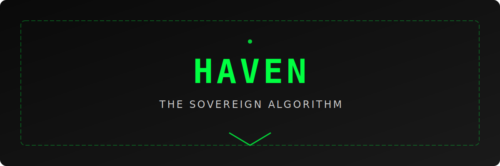

<div align="center">


# HAVEN — The Sovereign Algorithm

### Saudi Arabia's First Sovereign AI Development Environment

**v5.0 · Built by KHAWRIZM**

[](https://www.typescriptlang.org/)
[](https://react.dev/)
[](https://vitejs.dev/)
[]()
[]()

</div>

---

## Overview

**HAVEN** (Heuristic Autonomous Venture for Ethical Nodes) is a sovereign IDE, AI engine, and product landing ecosystem built entirely from scratch. Zero telemetry. Zero foreign API dependencies for core features. Full Saudi PDPL compliance. Every line of AI inference runs locally on the user's machine through Ollama.

This project exists to prove one thing: **Saudi Arabia does not need Silicon Valley's tools to build world-class software.**

---

## Architecture

```
┌────────────────────────────────────────────────────────────────┐
│                        HAVEN IDE Shell                         │
│  ┌──────────┐  ┌──────────┐  ┌──────────┐  ┌──────────────┐  │
│  │  Monaco   │  │ Terminal  │  │   Git    │  │  Extensions  │  │
│  │  Editor   │  │  (xterm)  │  │  Panel   │  │    Panel     │  │
│  └────┬─────┘  └──────────┘  └──────────┘  └──────────────┘  │
│       │                                                        │
│  ┌────▼─────────────────────────────────────────────────────┐  │
│  │              NiyahEngine (Arabic-First NLP)               │  │
│  │  ┌──────────┐  ┌───────────┐  ┌───────────────────────┐  │  │
│  │  │ Cognitive │  │ Executive │  │       Sensory         │  │  │
│  │  │   Lobe   │  │   Lobe    │  │   (Arabic Morphology) │  │  │
│  │  └──────────┘  └───────────┘  └───────────────────────┘  │  │
│  └──────────────────────┬────────────────────────────────────┘  │
│                         │                                       │
│  ┌──────────────────────▼────────────────────────────────────┐  │
│  │              ModelRouter (16 model families)               │  │
│  │  Ollama ─── ThreeLobeAgent ─── NiyahCompletionProvider    │  │
│  └───────────────────────────────────────────────────────────┘  │
│                                                                 │
│  ┌──────────────┐  ┌──────────────┐  ┌──────────────────────┐  │
│  │ ForensicLab  │  │  NodeRadar   │  │  HackingToolkit      │  │
│  │ (Real scans) │  │ (Real metrics│  │  (Security tools)    │  │
│  └──────────────┘  └──────────────┘  └──────────────────────┘  │
└────────────────────────────────────────────────────────────────┘
```

---

## Core Features

### NiyahEngine — Arabic-First Intent Analysis
- **Arabic Root Tokenizer** — extracts trilateral roots (جذر ثلاثي) from 90+ morphological patterns with 150+ root entries
- **Three-Lobe Architecture** — Cognitive (context & memory), Executive (planning & routing), Sensory (input parsing with Arabic morphological awareness)
- **Dialect Detection** — Gulf, Najdi, Hejazi, Egyptian, Levantine, Tunisian, Modern Standard Arabic
- **Tone & Domain Classification** — academic, casual, technical, business, security, creative
- **Sovereignty Scoring** — flags foreign telemetry patterns, dependency risks, and data-exit vectors
- **Intent Graph** — temporal, contextual, root, and domain edge linking across sessions
- **1,056 lines** of hand-written Arabic NLP — no external NLP library dependencies

### ModelRouter — Intelligent Multi-Model Routing
- **16 model families** supported across Ollama, HuggingFace, and local inference
- **Three-lobe routing** — matches intent complexity to optimal model size
- **918 lines** of routing logic with fallback chains and load balancing
- **Zero vendor lock-in** — swap models without changing application code

### Inline Niyah Suggestions
- 5-layer completion pipeline integrated into Monaco Editor
- Sovereign code patterns (PDPL-compliant, zero-telemetry templates)
- Arabic comment expansion, language-specific idioms (TS/Python/Rust/Go)
- File context analysis + intent memory from NiyahEngine sessions

### IntentGraph Visualization
- Interactive force-directed SVG layout of intent relationships
- Edge type filtering: context, root, domain, temporal
- Timeline slider, node drag support, PNG export
- Code-split into a separate chunk (16 KB gzipped)

### Full IDE Experience
- **Monaco Editor** with sovereign completion provider and multi-cursor support
- **File Explorer** — drag-and-drop with real filesystem via File System Access API
- **Integrated Terminal** — xterm.js v6 with 35+ built-in commands including `expose`, `sovereign`, `phalanx`, `niyah`
- **Git Panel** — staging, commits, diff view, branch management via isomorphic-git
- **Extensions Panel** — curated sovereign extensions with install/remove
- **Search** — regex support, grouped results, replace all
- **Settings Editor** — full IDE configuration with live preview
- **Keyboard Shortcuts** — searchable shortcut reference
- **Activity Bar** — keyboard navigation, ARIA roles, tooltips

### ForensicLab — Real Digital Evidence Analysis
- **Live browser forensics** — scans Performance API for telemetry domains in real-time
- **localStorage/cookie audit** — detects tracking keys (`_ga`, `_gid`, `fbclid`, etc.)
- **Service Worker inspection** — enumerates registered workers and scopes
- **Permission audit** — checks camera, microphone, geolocation, notification states
- **Evidence case files** — pre-loaded surveillance exposure documentation

### NodeRadar — Real System Metrics
- **Host machine metrics** — CPU cores, device memory, JS heap usage, storage quota, network type via browser APIs
- **Live refresh** — real metrics polled every 5 seconds
- **Sovereign mesh visualization** — radar display with sweep animation
- **Filtering** — by status (active/inactive/offline) and type (validator/full node/host)

### HackingToolkit — Security Analysis Suite
- 8 security analysis tools + 4 simulation modules
- Real WebRTC leak detection, browser fingerprint analysis
- Network telemetry scanning, cookie/storage forensics

### HavenChat — AI Ghost Companion
- Multi-model fallback chain (Llama 3.3 70B, Qwen3 32B, DeepSeek-R1-Distill 70B)
- Voice input (English/Arabic) via Web Speech API
- File attachment analysis with context-aware responses
- 5 interactive spells: sensitive-word fade, physics drift, wave, quantum coin, visibility toggle
- Offline fallback with pattern-matched local responses

### Professional Landing Page
- 19+ sections: Hero, Products, Benchmarks, Comparison, Expose, Digital Citizenship, Roadmap, Pricing, FAQ, and more
- **Bilingual** — full English/Arabic (EN/AR) with i18n translation system
- Dark mode, command palette (Ctrl+K), interactive terminal demo
- Smooth animations via Motion (Framer Motion v12)

---

## Tech Stack

| Layer | Technology | Version |
|-------|-----------|---------|
| Framework | React | 19 |
| Language | TypeScript | 5.8 (strict mode) |
| Bundler | Vite | 6 |
| State Management | Zustand | 5 |
| Code Editor | Monaco Editor | latest |
| CSS Framework | Tailwind CSS | 4 |
| Animation | Motion (Framer Motion) | 12 |
| Terminal | xterm.js | 6 |
| Git Engine | isomorphic-git + lightning-fs | 1.37 |
| Icons | Lucide React | 0.546 |
| Routing | React Router | 7 |
| Testing | Vitest | latest |

---

## Getting Started

### Prerequisites

- **Node.js** 18+ ([download](https://nodejs.org/))
- **npm** 9+ (included with Node.js)
- **Ollama** (optional, for local AI inference) ([download](https://ollama.com/))

### Installation

```bash
# Clone the sovereign repository
git clone https://github.com/Grar00t/haven-sovereign.git
cd haven-sovereign

# Install dependencies
npm install

# Copy environment config
cp .env.example .env

# Start the development server
npm run dev
```

Open **http://localhost:3000** to view the landing page. Navigate to **/ide** for the full IDE experience.

### Production Build

```bash
npm run build     # TypeScript check + Vite build → dist/
npm run preview   # Preview the production build locally
```

### Testing

```bash
npm test          # Run all tests with Vitest
npm run test:ui   # Run tests with Vitest UI
npm run coverage  # Generate coverage report
```

---

## Project Structure

```
HAVEN/
├── index.html                  # HTML entry point
├── package.json                # Dependencies & scripts (v5.0.0)
├── vite.config.ts              # Vite build configuration
├── tsconfig.json               # TypeScript config (strict mode)
├── metadata.json               # Project metadata & sovereignty flags
├── vercel.json                 # Vercel deployment config
├── .env.example                # Environment variables template
├── .gitignore                  # Git ignore rules
│
├── infra/                      # Infrastructure & deployment
│   ├── deploy-khawrizm.sh      # Production deployment script
│   └── bluvalt-provision.sh    # Saudi cloud provisioning
│
├── public/                     # Static assets
│
├── src/
│   ├── main.tsx                # Router — / → Landing, /ide → IDE
│   ├── App.tsx                 # Landing page shell (19 sections)
│   ├── index.css               # Tailwind v4 theme + sovereign styles
│   │
│   ├── lib/utils.ts            # Shared utilities (cn helper)
│   ├── store/useStore.ts       # Landing page Zustand store
│   ├── i18n/translations.ts    # Bilingual EN/AR translation keys
│   │
│   ├── hooks/                  # Custom React hooks
│   │   ├── useCountUp.ts       # Animated number counting
│   │   ├── useInView.ts        # Intersection Observer wrapper
│   │   ├── useMouseGlow.ts     # Cursor glow effect
│   │   ├── useParallax.ts      # Scroll parallax
│   │   ├── useScrollSpy.ts     # Section scroll tracking
│   │   ├── useTilt.ts          # 3D card tilt
│   │   └── useTypewriter.ts    # Typewriter text effect
│   │
│   ├── components/
│   │   ├── landing/            # 19 landing page sections
│   │   │   ├── Hero.tsx        # Main hero with TypeScript terminal
│   │   │   ├── Products.tsx    # Product showcase
│   │   │   ├── AIEngine.tsx    # NiyahEngine feature display
│   │   │   ├── Benchmarks.tsx  # Performance benchmarks
│   │   │   ├── Comparison.tsx  # Competitor comparison matrix
│   │   │   ├── Expose.tsx      # Big Tech surveillance expose
│   │   │   ├── Pricing.tsx     # Pricing tiers
│   │   │   ├── Roadmap.tsx     # Development roadmap
│   │   │   └── ...             # 11 more sections
│   │   │
│   │   └── shared/             # Reusable components
│   │       ├── HavenChat.tsx   # Ghost AI companion (1,080 lines)
│   │       ├── CommandPalette.tsx # Landing command palette
│   │       ├── InteractiveTerminal.tsx
│   │       └── ...             # 14 more shared components
│   │
│   └── ide/
│       ├── HavenIDE.tsx        # IDE shell & layout
│       ├── useIDEStore.ts      # IDE Zustand store
│       ├── types.ts            # IDE type definitions
│       │
│       ├── components/         # IDE panels & editors
│       │   ├── CodeEditor.tsx        # Monaco-based editor
│       │   ├── Terminal.tsx          # xterm.js terminal
│       │   ├── FileExplorer.tsx      # File tree
│       │   ├── ForensicLab.tsx       # Real forensic scanner
│       │   ├── NodeRadar.tsx         # Real system metrics radar
│       │   ├── HackingToolkit.tsx    # Security analysis suite
│       │   ├── CommandPalette.tsx    # IDE command palette
│       │   └── ...                   # 18 more IDE components
│       │
│       └── engine/             # AI & intelligence engines
│           ├── NiyahEngine.ts              # Arabic NLP (1,056 lines)
│           ├── NiyahCompletionProvider.ts  # 5-layer inline completion
│           ├── ModelRouter.ts              # Multi-model routing (918 lines)
│           ├── ThreeLobeAgent.ts           # Three-lobe AI agent (1,021 lines)
│           ├── OllamaService.ts            # Local Ollama integration (534 lines)
│           └── GitService.ts               # isomorphic-git service
```

---

## Sovereignty Promise

| Principle | Guarantee |
|-----------|-----------|
| **Zero Telemetry** | No data leaves the user's machine — ever |
| **Local-First AI** | All inference runs through Ollama on-device |
| **PDPL Compliant** | Saudi Personal Data Protection Law (نظام حماية البيانات الشخصية) |
| **NCA-ECC Aligned** | National Cybersecurity Authority Essential Controls |
| **No Vendor Lock-in** | Zero runtime dependencies on Google, Microsoft, or OpenAI |
| **Open Audit** | Every line of code is inspectable and sovereign |
| **Data Residency** | All storage is local — IndexedDB via lightning-fs |

---

## Available Scripts

| Command | Description |
|---------|-------------|
| `npm run dev` | Start development server on port 3000 |
| `npm run build` | Production build → `dist/` |
| `npm run preview` | Preview production build locally |
| `npm run lint` | TypeScript type-checking (`tsc --noEmit`) |
| `npm test` | Run tests with Vitest |
| `npm run test:ui` | Run tests with Vitest UI |
| `npm run coverage` | Generate test coverage report |
| `npm run clean` | Remove `dist/` directory |
| `npm run deploy` | Deploy via `infra/deploy-khawrizm.sh` |

---

## Security

- **No hardcoded secrets** — all API keys loaded from environment variables
- **API keys gitignored** — `.env` files excluded from version control
- **CSP headers** — Content Security Policy configured in deployment
- **No external analytics** — zero third-party tracking scripts
- **ForensicLab** — built-in tool to audit your own browser for tracking

---

## Author

**KHAWRIZM** — Sulaiman Alshammari (سليمان الشمري)

- **Website:** [khawrizm.com](https://khawrizm.com)
- **X:** [@khawrzm](https://x.com/khawrzm)
- **YouTube:** [@saudicyper](https://youtube.com/@saudicyper)
- **GitHub:** [@graxos](https://github.com/graxos)
- **Email:** [shammar403@gmail.com](mailto:shammar403@gmail.com)
- **Location:** Kingdom of Saudi Arabia

---

## License

**AGPL-3.0** — Open Source Sovereign Software.
See LICENSE for details.
Built in the Kingdom of Saudi Arabia. Copyright © 2024–2026 KHAWRIZM (Sulaiman Alshammari).

---

<div align="center">

**الخوارزمية السيادية**

*"We don't fork their tools. We replace them."*

**لا نستنسخ أدواتهم — نستبدلها.**

</div>
# haven-sovereign
# haven-sovereign
